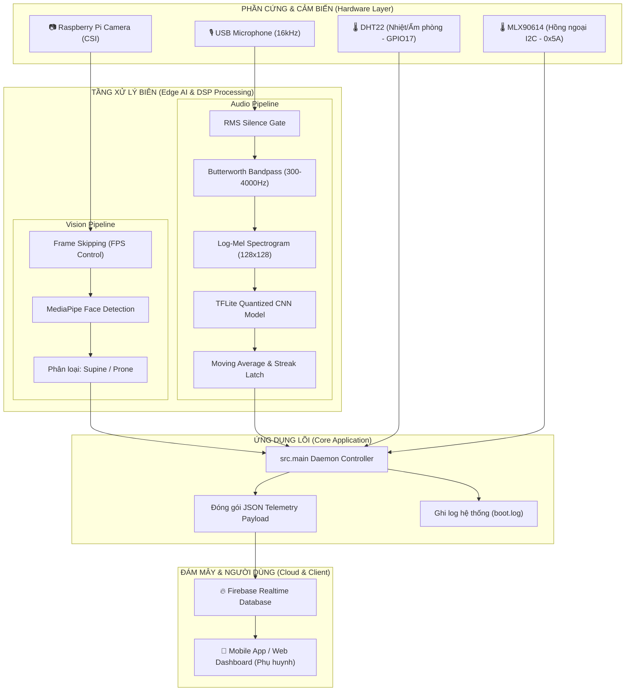

# 👶 Smart Baby Monitor Pi — Hệ Thống Giám Sát Trẻ Sơ Sinh Thông Minh

[](https://www.python.org/)
[](https://www.raspberrypi.com/)
[](https://www.tensorflow.org/lite)
[](https://developers.google.com/mediapipe)
[](https://firebase.google.com/)
[](https://opensource.org/licenses/MIT)

> **Hệ thống giám sát trẻ sơ sinh thông minh (Edge AI & IoT)** chạy trực tiếp trên thiết bị nhúng **Raspberry Pi**, tích hợp thị giác máy tính phát hiện tư thế ngủ, mô hình học sâu (Deep Learning) nhận diện tiếng khóc thời gian thực, cảm biến nhiệt độ - độ ẩm môi trường và cảm biến thân nhiệt hồng ngoại không tiếp xúc, tự động đồng bộ dữ liệu lên Firebase Realtime Database.

---

## 📑 Mục lục
1. [Giới thiệu tổng quan](#-giới-thiệu-tổng-quan)
2. [Tính năng cốt lõi](#-tính-năng-cốt-lõi)
3. [Kiến trúc hệ thống](#-kiến-trúc-hệ-thống)
4. [Sơ đồ phần cứng & Nối dây](#-sơ-đồ-phần-cứng--nối-dây)
5. [Cơ chế xử lý Edge AI & Tín hiệu](#-cơ-chế-xử-lý-edge-ai--tín-hiệu)
6. [Yêu cầu hệ thống](#-yêu-cầu-hệ-thống)
7. [Hướng dẫn cài đặt từ A-Z](#-hướng-dẫn-cài-đặt-từ-a-z)
8. [Cấu hình & Biến môi trường](#-cấu-hình--biến-môi-trường)
9. [Vận hành & Kiểm thử](#-vận-hành--kiểm-thử)
10. [Cấu hình chạy tự động (Systemd Service)](#-cấu-hình-chạy-tự-động-systemd-service)
11. [Định dạng dữ liệu truyền thông (Telemetry Schema)](#-định-dạng-dữ-liệu-truyền-thông-telemetry-schema)
12. [Cấu trúc mã nguồn](#-cấu-trúc-mã-nguồn)
13. [Xử lý sự cố thường gặp (Troubleshooting)](#-xử-lý-sự-cố-thường-gặp-troubleshooting)
14. [Giấy phép](#-giấy-phép)

---

## 🌟 Giới thiệu tổng quan

Hội chứng đột tử ở trẻ sơ sinh (**SIDS - Sudden Infant Death Syndrome**) thường xảy ra do trẻ nằm sấp úp mặt gây ngạt thở, nhiệt độ môi trường phòng quá nóng hoặc trẻ bị sốt cao nhưng không được phát hiện kịp thời. 

Dự án **Smart Baby Monitor Pi** được phát triển nhằm giải quyết triệt để vấn đề này với các tiêu chí:
- **Xử lý tại biên (Edge Computing)**: Toàn bộ thuật toán xử lý âm thanh tiếng khóc và thị giác máy tính được thực thi trực tiếp trên vi xử lý Raspberry Pi bằng mô hình lượng tử hóa (Quantized TFLite) và Google MediaPipe, đảm bảo tính bảo mật hình ảnh riêng tư và độ trễ cực thấp.
- **Giám sát đa thông số**: Kết hợp đồng thời thân nhiệt của trẻ, nhiệt độ phòng, độ ẩm không khí, tư thế ngủ (nằm ngửa vs nằm sấp) và phát hiện tiếng khóc.
- **Đồng bộ đám mây liên tục**: Gửi dữ liệu về **Firebase Realtime Database** để kết nối ứng dụng di động (Mobile App) hoặc trang quản trị (Web Dashboard) cho phụ huynh theo dõi mọi lúc, mọi nơi.

---

## 🚀 Tính năng cốt lõi

- 👁️ **Giám sát tư thế ngủ (Sleep Position Detection)**: 
  Sử dụng Raspberry Pi Camera kết hợp **MediaPipe Face Detection**. Khi bé quay mặt lên trên (nhận diện được khuôn mặt) hệ thống ghi nhận `supine` (nằm ngửa an toàn). Khi úp mặt hoặc quay sấp không nhận diện được mặt, hệ thống báo `prone` (nằm sấp - cảnh báo nguy cơ ngạt thở).
- 🔊 **Phát hiện tiếng khóc trẻ sơ sinh (Infant Cry Recognition)**:
  Thu âm liên tục qua Micro với tần số lấy mẫu 16 kHz. Áp dụng bộ lọc dải thông Butterworth (300 Hz – 4000 Hz), kiểm soát ngưỡng ồn RMS Gate, chuyển đổi sang ảnh Mel-Spectrogram (128x128) và phân loại bằng mạng nơ-ron tích chập (CNN TFLite). Tích hợp thuật toán làm mịn trung bình trượt và chốt chu kỳ (Latch Duration) để tránh cảnh báo giả.
- 🌡️ **Đo thân nhiệt không tiếp xúc (Non-contact Body Temp)**:
  Sử dụng cảm biến hồng ngoại **MLX90614** qua giao tiếp $I^2C$, đo chính xác nhiệt độ bề mặt bé (Object Temperature) kèm hiệu chuẩn nhiệt độ offset (+2.0°C).
- 🏠 **Giám sát môi trường phòng (Room Climate Monitoring)**:
  Đo nhiệt độ và độ ẩm phòng theo thời gian thực bằng cảm biến kỹ thuật số **DHT22 (AM2302)**.
- ☁️ **Tích hợp Firebase Realtime Database**:
  Đẩy dữ liệu định kỳ mỗi 5 giây (có thể tùy biến). Hỗ trợ chế độ chạy Offline Test mà không cần kết nối mạng.
- 🛡️ **Khả năng tự phục hồi (Robust Self-Healing)**:
  Tự động kiểm tra mạng trước khi chạy, kill các process chiếm dụng camera trước đó, xử lý biệt lệ lỗi cảm biến mà không làm treo hệ thống.

---

## 🏗️ Kiến trúc hệ thống



---

## 🔌 Sơ đồ phần cứng & Nối dây

### 1. Danh sách linh kiện (Bill of Materials)

| Linh kiện | Vai trò | Giao tiếp |
| :--- | :--- | :--- |
| **Raspberry Pi 4B / 3B+** | Bộ xử lý trung tâm (Edge Gateway) | Raspberry Pi OS (Debian bookworm/bullseye) |
| **Pi Camera Module (v1/v2/OV5647)** | Ghi nhận hình ảnh bé ngủ | CSI Ribbon Cable |
| **USB Microphone / Audio Dongle** | Thu nhận âm thanh môi trường | Cổng USB (ALSA / PulseAudio) |
| **Cảm biến MLX90614 (GY-906)** | Đo thân nhiệt hồng ngoại không tiếp xúc | I2C (Bus 1, Addr `0x5A`) |
| **Cảm biến DHT22 (AM2302)** | Đo nhiệt độ và độ ẩm phòng | 1-Wire Digital (GPIO17) |
| **Điện trở kéo 4.7kΩ - 10kΩ** | Kéo trở dữ liệu cho DHT22 (nếu dùng module rời) | Nối giữa DATA và 3.3V |
| **Dây cắm Jumper & Nguồn 5V-3A** | Cấp nguồn và kết nối mạch | Chân GPIO 40-Pin |

---

### 2. Bảng sơ đồ chân (Pinout Map)

```
       Raspberry Pi 40-Pin Header
             +3V3  (1) (2)  +5V
     SDA1 (GPIO2)  (3) (4)  +5V
     SCL1 (GPIO3)  (5) (6)  GND
            GPIO4  (7) (8)  GPIO14
              GND  (9) (10) GPIO15
    DATA (GPIO17) (11) (12) GPIO18
           ...    ... ...   ...
```

| Cảm biến | Chân Cảm Biến | Chân Raspberry Pi (BOARD Pin) | Tên Chân (BCM GPIO) | Mô tả |
| :--- | :--- | :--- | :--- | :--- |
| **MLX90614** | `VIN` | Pin 1 | `3.3V Power` | Nguồn cấp 3.3V DC |
| | `GND` | Pin 6 | `GND` | Nối đất Ground |
| | `SDA` | Pin 3 | `GPIO 2 (SDA1)` | Dữ liệu truyền nhận I2C |
| | `SCL` | Pin 5 | `GPIO 3 (SCL1)` | Xung nhịp I2C |
| **DHT22** | `VCC` | Pin 1 hoặc Pin 17 | `3.3V Power` | Nguồn cấp 3.3V |
| | `DATA` | Pin 11 | `GPIO 17` | Tín hiệu cảm biến 1-wire |
| | `GND` | Pin 14 (hoặc Pin 6/9) | `GND` | Nối đất Ground |
| **Camera** | `Ribbon` | Cổng CSI | `CSI Camera Port` | Kết nối camera dải băng |
| **Microphone**| `USB` | Cổng USB 2.0/3.0 | `USB Port` | Giao diện thu âm |

> [!CAUTION]
> **Lưu ý quan trọng về chân GPIO**: 
> - Chân vật lý số **9** trên header Raspberry Pi là chân **GND**, **tuyệt đối không cắm chân DATA của DHT22 vào chân 9**. Chân DATA DHT22 được cấu hình mặc định vào **GPIO 17** (tương ứng chân vật lý số **11**).
> - Cảm biến MLX90614 sử dụng nguồn **3.3V**. Không cắm vào chân 5V để tránh cháy cảm biến hoặc hỏng chân GPIO I2C của Pi.

---

## 🧠 Cơ chế xử lý Edge AI & Tín hiệu

### 1. Nhận diện tư thế ngủ (Pose Classification)
- Thư viện: `Picamera2` + `mediapipe.solutions.face_detection`.
- Cơ chế tối ưu:
  - Khung hình capture ở độ phân giải $640 \times 480$.
  - Thực hiện kĩ thuật **Frame Skipping**: Chỉ xử lý suy luận (inference) mỗi $N$ frame (`INFER_EVERY_N_FRAMES = 2`) nhằm giảm nhiệt độ chip và mức tiêu hao CPU.
  - Phân loại tư thế:
    - Nếu phát hiện mắt, mũi, miệng (`detections > 0`) $\rightarrow$ Bé đang nằm ngửa (`supine`).
    - Nếu không phát hiện khuôn mặt $\rightarrow$ Bé đang nằm sấp hoặc úp mặt (`prone`).

### 2. Nhận diện tiếng khóc (Cry Detection Pipeline)
```
[Microphone Audio 16kHz]
          │
          ▼
   [Tính RMS Energy]  ────(RMS < 0.001: Yên tĩnh)────► pCry = 0.0
          │
          ▼ (RMS >= Ngưỡng kích hoạt)
[Bộ lọc Bandpass Butterworth (300Hz - 4kHz)]
          │
          ▼
[Biến đổi Mel-Spectrogram (128 Mel bands, n_fft=1024)]
          │
          ▼
[Chuyển Log-dB Scale & Chuẩn hóa sang ảnh RGB 128x128]
          │
          ▼
[TensorFlow Lite Quantized CNN Inference]
          │
          ▼
[Làm mịn trung bình xác suất (Moving Average n=3)]
          │
          ▼
[Kiểm tra thời gian vượt ngưỡng liên tục (Streak >= 1.0s)]
          │
          ▼
   [Kích hoạt isCrying = True + Chốt giữ (Latch Hold 3.0s)]
```

---

## 💻 Yêu cầu hệ thống

- **Hệ điều hành**: Raspberry Pi OS (Bullseye hoặc Bookworm 64-bit khuyến nghị).
- **Python**: Phiên bản 3.10 hoặc 3.11+.
- **Phần cứng hỗ trợ**: Raspberry Pi 3B+, 4B hoặc 5; Cảm biến DHT22, MLX90614, Camera v1/v2, Micro USB.
- **Thư viện hệ thống**:
  - `python3-picamera2`
  - `libatlas-base-dev`
  - `portaudio19-dev`
  - `pulseaudio`

---

## 🛠️ Hướng dẫn cài đặt từ A-Z

### Bước 1: Kích hoạt giao tiếp phần cứng trên Raspberry Pi

Mở terminal trên Raspberry Pi và chạy:
```bash
sudo raspi-config
```
- Vào **Interface Options**:
  - Kích hoạt **I2C** $\rightarrow$ `Yes`
  - Kích hoạt **Camera** (Legacy Camera hoặc PiCamera tuỳ phiên bản OS) $\rightarrow$ `Yes`
- Khởi động lại Raspberry Pi:
```bash
sudo reboot
```

Kiểm tra địa chỉ I2C của MLX90614 (phải thấy hiển thị địa chỉ `5a`):
```bash
sudo apt update && sudo apt install -y i2c-tools
i2cdetect -y 1
```

---

### Bước 2: Cài đặt gói phụ thuộc hệ thống (System Packages)

```bash
sudo apt update
sudo apt install -y python3-pip python3-venv python3-picamera2 \
                    libatlas-base-dev portaudio19-dev pulseaudio libasound2-dev
```

---

### Bước 3: Tạo môi trường ảo & Cài đặt thư viện Python

Di chuyển vào thư mục dự án:
```bash
cd ~/baby-monitor-pi
```

Tạo và kích hoạt môi trường ảo Python:
```bash
python3 -m venv .venv --system-site-packages
source .venv/bin/activate
```
*(Tùy chọn `--system-site-packages` giúp môi trường ảo nhận diện gói `picamera2` cài từ APT)*.

Cài đặt các thư viện cần thiết:
```bash
pip install --upgrade pip
pip install -r requirements.txt
```

---

### Bước 4: Chuẩn bị Model và Khóa xác thực Firebase

1. **Mô hình TFLite**: Đảm bảo các tệp mô hình nằm đúng vị trí:
   - `src/assets/model.tflite`
   - `src/assets/classes.npy`
2. **Khóa dịch vụ Firebase (Service Account Key)**:
   - Tải tệp JSON từ Firebase Console (*Project Settings -> Service accounts -> Generate new private key*).
   - Đặt file JSON trong thư mục `src/` (hoặc cấu hình đường dẫn qua biến môi trường `FIREBASE_CRED_JSON`).

---

## ⚙️ Cấu hình & Biến môi trường

Toàn bộ thông số hoạt động của hệ thống có thể tùy biến linh hoạt thông qua biến môi trường hoặc tệp `src/config.py`:

| Biến môi trường | Giá trị mặc định | Giải thích |
| :--- | :--- | :--- |
| `PRINT_INTERVAL` | `5.0` | Chu kỳ đóng gói và gửi dữ liệu lên Firebase (giây) |
| `CRY_HOLD_SEC` | `3.0` | Thời gian chốt giữ trạng thái `isCrying = True` sau khi phát hiện tiếng khóc |
| `FIREBASE_SKIP` | `0` | Đặt `1` để bỏ qua việc đẩy dữ liệu lên Firebase (dành cho chế độ chạy offline) |
| `FIREBASE_CRED_JSON` | Đường dẫn file JSON | Đường dẫn tuyệt đối tới tệp Firebase Admin SDK JSON |
| `FIREBASE_DB_URL` | URL Firebase | Đường dẫn Database URL của Firebase Realtime Database |
| `FIREBASE_BASE_PATH` | `sleepData` | Node gốc lưu trữ dữ liệu trên Realtime Database |
| `CRY_DEVICE` | `pulse` hoặc `None` | Thiết bị âm thanh đầu vào (ALSA/PulseAudio device name hoặc index) |
| `CRY_THR` | `0.5` | Ngưỡng xác suất để nhận diện âm thanh là tiếng khóc |
| `CRY_MIN_DUR` | `1.0` | Khoảng thời gian liên tục vượt ngưỡng cần thiết (giây) để kích hoạt sự kiện |
| `CRY_RMS_GATE` | `0.001` | Ngưỡng năng lượng âm thanh để lọc khoảng lặng (tránh infer lãng phí CPU) |
| `CRY_SMOOTH` | `3` | Số lượng cửa sổ dùng để tính trung bình trượt xác suất |
| `CRY_NO_BANDPASS` | `""` | Đặt bất kỳ giá trị nào nếu muốn tắt bộ lọc dải thông Butterworth |

---

## 🚦 Vận hành & Kiểm thử

### 1. Kiểm tra Micro và Mô hình âm thanh độc lập

Sử dụng công cụ kiểm thử tích hợp sẵn trong `src/tools/test_cry_detector.py`:

- **Liệt kê danh sách các cổng thu âm thanh**:
  ```bash
  python -m src.tools.test_cry_detector --list-devices
  ```
- **Kiểm tra trực tiếp từ Microphone**:
  ```bash
  python -m src.tools.test_cry_detector --device pulse --cry-thr 0.5
  ```
- **Kiểm tra với một tệp âm thanh WAV có sẵn**:
  ```bash
  python -m src.tools.test_cry_detector --wav samples/baby_cry_sample.wav
  ```

---

### 2. Khởi chạy toàn bộ hệ thống

**Cách 1: Khởi chạy bằng kịch bản tự động (`run.sh`)**:
Kịch bản này sẽ tự động kiểm tra mạng (chờ tối đa 60 giây), dọn dẹp các tiến trình camera cũ và chuyển tiếp log vào `boot.log`:
```bash
chmod +x run.sh
./run.sh
```

**Cách 2: Chạy trực tiếp qua Python**:
```bash
source .venv/bin/activate
python -u -m src.main
```

Xem log hoạt động thời gian thực:
```bash
tail -f boot.log
```

---

## 🔄 Cấu hình chạy tự động (Systemd Service)

Để hệ thống tự động khởi động ngay khi Raspberry Pi bật nguồn (Auto-boot on startup), tạo một service systemd:

Tạo tệp service:
```bash
sudo nano /etc/systemd/system/baby-monitor.service
```

Thêm nội dung sau (điều chỉnh đường dẫn phù hợp với user của bạn):
```ini
[Unit]
Description=Smart Baby Monitor Pi Service
After=network-online.target sound.target
Wants=network-online.target

[Service]
Type=simple
User=admin
WorkingDirectory=/home/admin/baby-monitor-pi
ExecStart=/bin/bash /home/admin/baby-monitor-pi/run.sh
Restart=always
RestartSec=5
StandardOutput=journal
StandardError=journal

[Install]
WantedBy=multi-user.target
```

Kích hoạt và khởi chạy service:
```bash
sudo systemctl daemon-reload
sudo systemctl enable baby-monitor.service
sudo systemctl start baby-monitor.service
```

Kiểm tra trạng thái hoạt động:
```bash
sudo systemctl status baby-monitor.service
```

---

## 📊 Định dạng dữ liệu truyền thông (Telemetry Schema)

Mỗi chu kỳ (mặc định 5s), hệ thống xuất ra console và gửi gói JSON lên Firebase Realtime Database tại đường dẫn `/sleepData/{pushId}`:

### Mẫu dữ liệu JSON:
```json
{
  "babyTemperature": 36.85,
  "environmentTemperature": 27.42,
  "environmentHumidity": 65.4,
  "temperature": 27.3,
  "sleepPosition": "supine",
  "isCrying": false,
  "status": "sleeping",
  "timestamp": "2026-10-03T14:49:57+07:00"
}
```

### Bảng giải thích chi tiết các trường dữ liệu:

| Trường (Key) | Kiểu dữ liệu | Đơn vị / Giá trị | Mô tả |
| :--- | :--- | :--- | :--- |
| `babyTemperature` | `float` hoặc `null` | °C (Celsius) | Thân nhiệt bề mặt của bé (đo bằng cảm biến hồng ngoại MLX90614) |
| `environmentTemperature` | `float` hoặc `null` | °C (Celsius) | Nhiệt độ môi trường đo từ cảm biến MLX90614 |
| `environmentHumidity` | `float` hoặc `null` | % (0 - 100) | Độ ẩm tương đối trong phòng (đo bằng DHT22) |
| `temperature` | `float` hoặc `null` | °C (Celsius) | Nhiệt độ phòng đo từ cảm biến DHT22 |
| `sleepPosition` | `string` | `"supine"` \| `"prone"` \| `"unknown"` | Tư thế ngủ: nằm ngửa (`supine`), nằm sấp (`prone`) |
| `isCrying` | `boolean` | `true` \| `false` | Trạng thái phát hiện tiếng khóc của bé |
| `status` | `string` | `"sleeping"` \| `"crying"` | Trạng thái tổng quát của bé |
| `timestamp` | `string` | ISO 8601 (UTC+7) | Dấu thời gian ghi nhận (Múi giờ Việt Nam) |

---

## 📂 Cấu trúc mã nguồn

```
baby-monitor-pi-final/
├── README.md                      # Tài liệu hướng dẫn dự án chi tiết
├── requirements.txt               # Danh sách thư viện Python cần thiết
├── run.sh                         # Shell script quản lý khởi động & môi trường
├── boot.log                       # Tệp log lưu vết quá trình thực thi
├── src/
│   ├── __init__.py                # Khởi tạo Python package
│   ├── config.py                  # Cấu hình GPIO, I2C, Camera, Audio, Calib
│   ├── firebase_client.py         # Module kết nối và đẩy dữ liệu Firebase RTDB
│   ├── main.py                    # Chương trình điều khiển chính (Main Event Loop)
│   ├── baby-sleep-tracker-*.json  # Khóa xác thực Firebase Service Account
│   ├── assets/
│   │   ├── README.txt             # Ghi chú thư mục assets
│   │   ├── classes.npy            # Nhãn phân loại mô hình (['cry', 'not_cry'])
│   │   └── model.tflite           # Trọng số mô hình nhận diện tiếng khóc (CNN TFLite)
│   ├── sensors/
│   │   ├── __init__.py
│   │   ├── camera_supine_prone.py # Nhận diện tư thế mặt bằng MediaPipe
│   │   ├── cry_detector.py        # Pipeline nhận diện tiếng khóc (Audio DSP + TFLite)
│   │   ├── dht22.py               # Trình điều khiển đọc nhiệt độ & độ ẩm phòng
│   │   └── mlx90614.py            # Trình điều khiển I2C đọc thân nhiệt hồng ngoại
│   └── tools/
│       └── test_cry_detector.py   # Công cụ CLI kiểm thử micro và âm thanh
```

---

## ❓ Xử lý sự cố thường gặp (Troubleshooting)

### 1. Lỗi: `No input device matching 'pulse'` hoặc lỗi không tìm thấy Micro
- **Nguyên nhân**: PulseAudio daemon chưa khởi động hoặc tên thiết bị không khớp.
- **Khắc phục**:
  1. Kiểm tra thiết bị âm thanh bằng lệnh:
     ```bash
     arecord -l
     python -m src.tools.test_cry_detector --list-devices
     ```
  2. Xuất biến môi trường sử dụng device index hoặc tên thiết bị cụ thể (ví dụ thiết bị số 0):
     ```bash
     export CRY_DEVICE="0"
     ```

### 2. Lỗi: `Camera read failed` hoặc `Camera resource busy`
- **Nguyên nhân**: Một tiến trình khác (hoặc lần chạy trước) đang chiếm giữ tiến trình `libcamera` / `picamera2`.
- **Khắc phục**:
  Giải phóng tiến trình đang chiếm camera:
  ```bash
  sudo pkill -f "python.*src.main"
  sudo pkill -f "libcamera"
  ```

### 3. Cảm biến DHT22 trả về `None`
- **Nguyên nhân**: DHT22 giao tiếp theo giao thức 1-wire phụ thuộc chặt chẽ vào thời gian thực tế (timing), thỉnh thoảng sẽ có frame lỗi dữ liệu hoặc nối dây lỏng.
- **Khắc phục**:
  - Module `src/sensors/dht22.py` đã tích hợp cơ chế tự động thử lại 3 lần (`max_retries=3`).
  - Kiểm tra điện trở kéo (Pull-up resistor 4.7kΩ) giữa chân DATA và 3.3V.
  - Kiểm tra xem đã kết nối đúng chân **GPIO17 (Pin 11)** hay chưa.

### 4. Lỗi `Firebase push failed: No such file or directory`
- **Nguyên nhân**: Đường dẫn `FIREBASE_CRED_JSON` trỏ đến tệp không tồn tại.
- **Khắc phục**:
  Kiểm tra tên file JSON thực tế trong `src/` và cập nhật đường dẫn chính xác trong `run.sh` hoặc export biến:
  ```bash
  export FIREBASE_CRED_JSON="$(pwd)/src/baby-sleep-tracker-a4f6c-firebase-adminsdk-fbsvc-beb6936966.json"
  ```

---

## 📄 Giấy phép

Dự án được phân phối dưới giấy phép **MIT License**. Bạn được toàn quyền sử dụng, sửa đổi và phân phối cho mục đích học tập cũng như thương mại.
